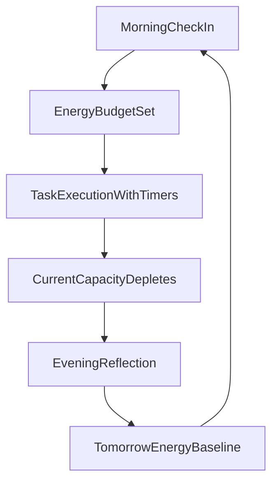

## Project context (for AI + contributors)

### Purpose
HelpMe is an AI personal assistant that helps a human decide what to do next by turning daily context + tasks into a clear, bio-adaptive prioritized plan.

### Core philosophy
- **Human-first**: suggestions, not commands. The user stays in control.
- **Energy is a currency**: planning must match biological reality to prevent burnout and protect deep focus.
- **Explainability**: prioritization must include short, explicit reasoning.

### Primary duties
- Capture daily context (“morning check-in” / bio-calibration): sleep/rest quality and signals that inform today’s **EnergyBudget**.
- Manage tasks: create/edit, status, due dates, intensity, and optional metadata (effort/tags).
- Prioritize tasks: produce a ranked list with short, explicit reasoning based on energy and constraints.
- Run a daily loop: capacity-aware execution, timers, and feedback that adapts depletion.
- Close the day: evening reflection summary and AI-driven prediction for tomorrow’s baseline.

### Scope (v1)
In scope:
- Single-user experience (no complex org/team features).
- Server-side AI calls (Bedrock) + server-side persistence (Neon Postgres via Mikro-ORM).
- Explainable prioritization output.

Out of scope (for now):
- Calendar write access / auto-scheduling that edits external calendars.
- Complex collaboration, approvals, or enterprise workflows.
- “Autonomous agent” actions that execute tasks without user confirmation.

### Key workflows / rituals
- **Morning check-in (Bio-Calibration)**: user logs sleep/rest quality (1–10) and optional notes → sets **EnergyBudget**.
- **Task execution (Dynamic Capacity Tracking)**:
  - tasks have **TaskIntensity**: `DeepFocus` / `Routine` / `QuickWin`
  - completing tasks depletes **CurrentCapacity**
  - user feedback state (**CapacityState**): `Fresh` / `Tired` / `Taxed` can adjust depletion rate
- **Evening reflection**: summarize the day and capture “how it went”.
- **Tomorrow prediction**: AI suggests tomorrow’s likely baseline energy from trends.

### Domain language (preferred terms)
- CheckIn: date, restQuality1to10, notes, energyBudget
- Task: title, status, dueAt, intensity, effortMinutes, tags
- Plan: date, rankedTasks, timeBlocks, reasoningSummary
- Capacity: energyBudget, currentCapacity, capacityState (Fresh/Tired/Taxed)

### Page architecture (product)
- Today (Dashboard): morning check-in card, active task list + timers, evening reflection hook.
- WeeklyPlan (Strategic Horizon): 7-day view with “smart schedule” to spread high-intensity tasks.
- BioTrends (Analytics): correlate rest level and output; track average deep focus hours.
- MasterList (Archive): all pending/completed objectives separate from daily focus.
- Calibration (Profile): chronotype (peak focus hours) and standard working window.

### Stack
- Next.js (App Router)
- Tailwind CSS + shadcn/ui
- AWS Bedrock (server-side)
- Neon Postgres + Mikro-ORM
- Deploy: Vercel

### Architectural boundaries (important)
- **UI**: `app/**`, `components/**`
  - shadcn/ui primitives: `components/ui/**`
- **Server Actions (primary backend surface)**: `app/_actions/**`
- **Features (business logic, preferred for readability)**: `lib/features/**`
  - Schemas/types: `lib/features/<feature>/schema.ts`, `types.ts`
  - Use cases: `lib/features/<feature>/use-cases/**`
- **Integrations**: `lib/**`
  - Bedrock client/wrappers: `lib/bedrock/**`
  - DB + Mikro-ORM: `lib/db/**`
  - Env parsing/validation: `lib/env.ts`
  - Shared validation helpers: `lib/validation/**`

### DB style (Mikro-ORM)
- Use **Data Mapper** style (no Active Record).
- Do persistence via `EntityManager` / repositories in `lib/features/<feature>/use-cases/**`.
- Entities may contain **pure** methods (no DB/network/EM).

### Security rules
- Never expose secrets to the client:
  - `DATABASE_URL`, AWS credentials, Bedrock model IDs should remain server-only.
- Bedrock + DB code must run on the server (Node runtime). Avoid Edge for these integrations.

### Deployment rules (Vercel)
- Configure environment variables in Vercel Project Settings.
- Do not run migrations during web requests. Use a separate migration workflow.

### Conventions
- Prefer Server Components by default.
- Prefer Server Actions for mutations / orchestrating “Bedrock + DB” work.
- Use API routes only when you truly need HTTP endpoints (webhooks/external clients).
- Keep Server Actions thin: validate → call use-case → return typed result.

### Quality guardrails
- Prefer **guard clauses** (early returns) for validation/authorization/invariants.
- Prefer `unknown` over `any`. Explicit `any` is disallowed by lint.
- When rethrowing/wrapping errors, include a **cause** (e.g. `new Error(msg, { cause })`) or use `AppError`.
- Prefer descriptive generic names in TypeScript (avoid `T`, `E` in non-trivial code).
- Avoid “god files”: keep files small and focused. Split large logic into feature modules, schemas/types, and use-cases.
- Null-safety: `null` = absent (domain/DB). `""` = UI-only empty string. Normalize optional strings (trim, then empty → `null`) at boundaries.
- Readability: use whitespace/proximity intentionally—group related lines, and separate different concerns with a single blank line.

